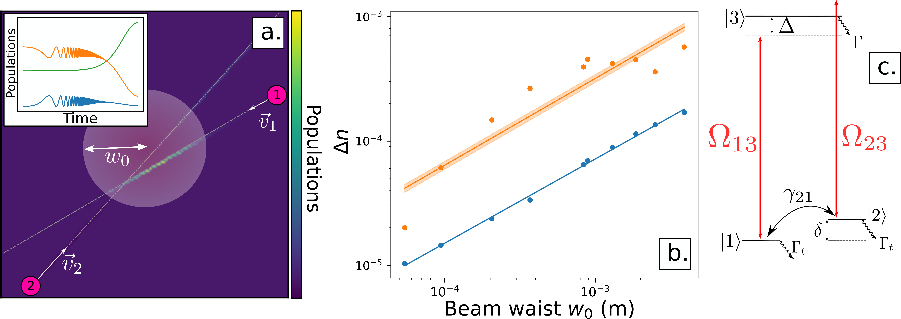

# The paper 
Code supporting [Transit effects for non-linear index measurement in hot atomic vapors](https://arxiv.org/abs/2202.05764).\
This code aims at giving the tools for both measurement and numerical estimation of non-linear index of refractions in hot alkali vapors.\
It aims at providing an easily reusable codebase in modern langages (Python) while benefiting from the performance of a compiled langage (Julia).\
**Please note : This code base is provided without any guarantee nor reliable support. However feel free to raise an issue if you want to reuse the code and need some help.**\
Please do cite us !
```
@misc{aladjidi2022transit,
      title={Transit effects for non-linear index measurement in hot atomic vapors}, 
      author={Tangui Aladjidi and Murad Abuzarli and Guillaume Brochier and Tom Bienaimé and Thomas Picot and Alberto Bramati and Quentin Glorieux},
      year={2022},
      eprint={2202.05764},
      archivePrefix={arXiv},
      primaryClass={quant-ph}
}
```

# Usage
The codebase provides two main components : one for measurement, the other for simulation.

## Phase measurement

All image processing utilities are in [`contrast.py`](./contrast.py). \
The workhorse of these utilities is the `im_osc` function :
```python
def im_osc(im: np.ndarray,  cont: bool = True, plot: bool = False) -> tuple:
    """Separates the continuous and oscillating components of an image using
    Fourier filtering.

    :param np.ndarray im: Description of parameter `im`.
    :param bool cont: Returns or not the continuons component
    :param bool plot: Plots a visualization of the analysis result
    :return np.ndarray: The oscillating component of the image, or both
    components

    """
    ...
    return im_cont, im_fringe
```
This function will analyze an interferogram and automatically extract the continuous and oscillating components.\
Its workflow is represented in the following .


## Atomic Monte-Carlo simulations

The aomic simulations are written mainly in Julia and wrapped to a convenient Python class in [`bloch_time.py`](./bloch_time.py).\
Physical parameters such as detuning, cell temperature, cell length etc... can be easily specified using the `__init__` method of the class.\ 
The physical setup is described at length in the [paper](docs/2202.05764.pdf), but it can be easily summarized in the following  
For each velocity class and each passing atom, we solve the Maxwell-Bloch equations all along the atom's trajectory and accumulate the states in a 2D grid.\
The actual solving is done using the Julia codes [`do_V_span.jl`](./do_V_span.jl) and [`do_V_span_pop.jl`](./do_V_span_pop.jl). \
The RHS and skeleton of the "fast" julia code was also adapted in Python using Numba. While not providing the actual Monte-Carlo part of the simulation, it should be a good start if you do not want to fuss with Julia code. 
# Dependencies
These are the main depedencies of the codebase.\
For Python :
  - PyJulia : **needs to be statically linked to libpython to work !** See PyJulia documentation for further details.
  - Numpy
  - scikit-image
  - Numba (for JIT compilation)
  
For Julia :
  - DifferentialEquations
  - ProgressBars
  - Distributions


